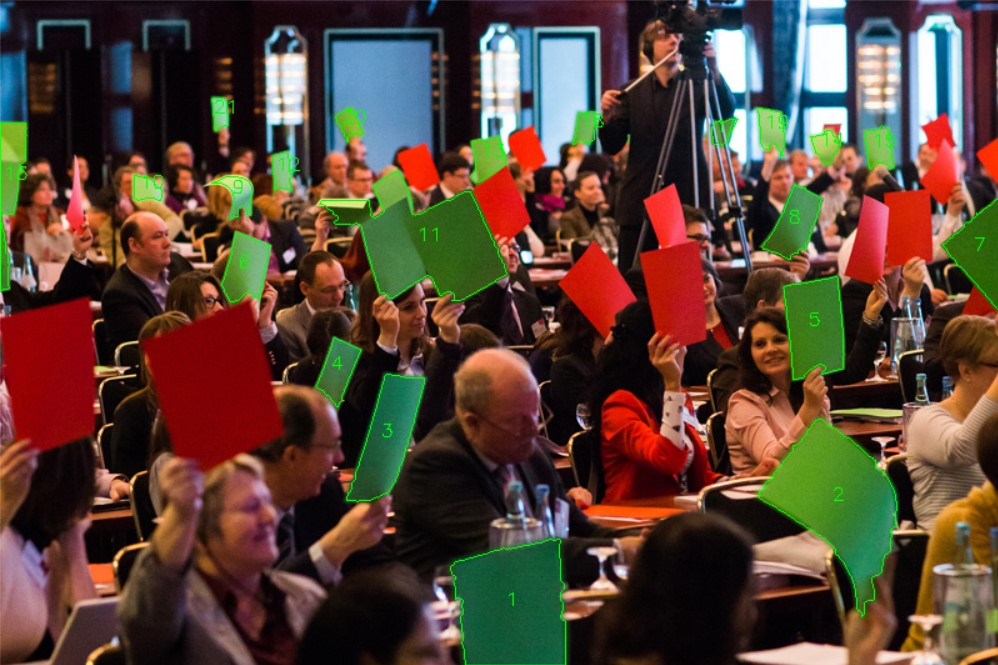

# colorCounter

you would have guessed it: it counts objects of certain colors within an image.

It creates masks in HSV color space and counts resulting blobs after applying some cleanup operations (dilation/erosion, filtering etc).
currently, color is defined as Hue Value + Range, and min/max values for Saturation and Luminance.

Biggest issue so far is intersection of elements because of perspective, as there is no segmentation to differentiate individual instances.
Simple solution will be printing a blank frame around the cards so they don't intersect visually.

## Status:
work-in-progress. in the future, it hopefully will  
- support A/B-Voting (e.g. red/green)
- plot the result as a pie chart like in [this example](https://datascienceparichay.com/article/plot-pie-chart-matplotlib/)
- maybe even have an interactive UI like [this Example](https://docs.opencv.org/3.4/db/df6/tutorial_erosion_dilatation.html)
- and eventually work with live-video input (webcam / raspberry)
